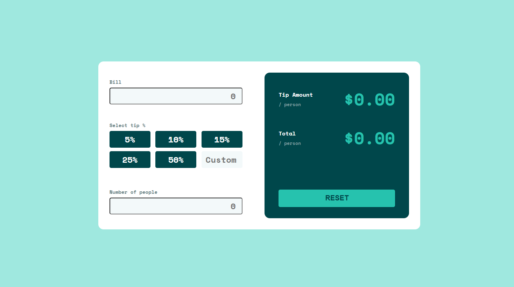

# 💸 Tip Calculator (TypeScript)

Простий і зручний калькулятор чайових, створений за допомогою **TypeScript**, **HTML** і **CSS**. Дозволяє швидко розрахувати суму чайових і загальну оплату на одну людину.

---

## 🔍 Попередній перегляд



---

## ⚙️ Основні можливості

✅ Введення суми рахунку  
✅ Вибір відсотка чайових (5%, 10%, 15%, 25%, 50%)  
✅ Введення кастомного відсотка  
✅ Введення кількості людей  
✅ Автоматичний розрахунок:  
  ・💰 Чайові / особу  
  ・💳 Загальна сума / особу  
✅ Кнопка скидання значень

---

## 🛠️ Використані технології

- **TypeScript**
- **HTML5**
- **CSS3**
- **DOM API**
- **GitHub Pages** (для розгортання)

---

📄 Приклад використання інтерфейсу DOM-елементів (TypeScript)

```ts
interface TipCalculatorElements {
  bill: HTMLInputElement;
  tips: NodeListOf<HTMLButtonElement>;
  customTip: HTMLInputElement;
  numberOFPeople: HTMLInputElement;
  tipAmount: HTMLParagraphElement;
  total: HTMLParagraphElement;
  form: HTMLFormElement;
}
```

## 📁 Структура проєкту
```
TS-tip-calculator/
├── dist/ # Згенеровані файли JS (потрібні для публікації)
│ ├── app.js
│ └── app.js.map
├── src/
│ ├── app.ts # Код TypeScript
│ └── images/
│ └── Preview.png # Зображення для README
├── style/
│ └── style.css # Стилі
├── index.html # Основна HTML-сторінка
├── package.json
├── tsconfig.json
├── .gitignore
└── README.md # Поточний файл
```

## 🚀 Запуск

1. Клонуй репозиторій:

```bash
git clone https://github.com/JuliyaPershina/TS-tip-calculator
```
2. Встанови залежності (за потреби):

```bash
npm install
```

3. Запусти локальний сервер:


```bash
npm run dev
```

🚀 Як запустити проєкт локально
1. Відкрий файл index.html у браузері:

    - Перетягни файл у вікно браузера
або

2. Запусти проєкт через Live Server у VS Code:

    - Клікни правою кнопкою миші на index.html

    - Обери "Open with Live Server"

⚠️ Переконайся, що файл dist/app.js існує. Якщо ні — виконай команду npm run build, щоб скомпілювати TypeScript.

🧾 З цим калькулятором жодних складних підрахунків — тільки прості цифри, чистий дизайн і легке використання!
Твоїм друзям сподобається, коли рахунок буде поділений точно 

📜 Ліцензія
Проєкт створено в навчальних цілях. Можна використовувати вільно.

👤 Автор
Розроблено як частина практики роботи з DOM та TypeScript.


